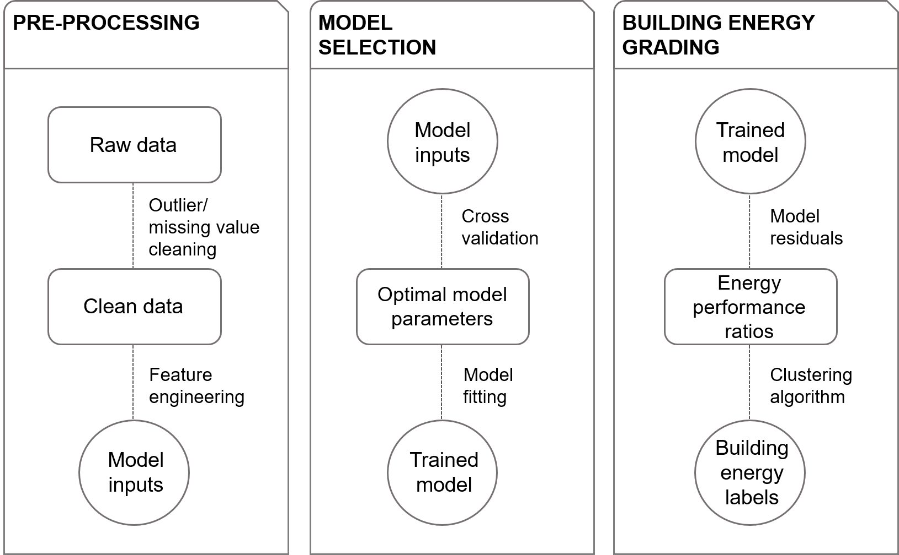
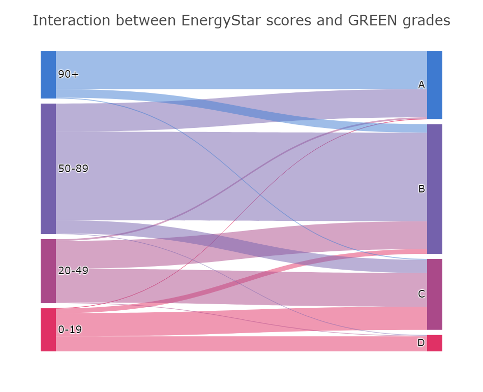

# GREEN: A city-specific building energy performance grading system

GREEN is a novel building energy performance grading system based on __machine learning__ and __city benchmarking data__. The grading process is detailed below:

GREEN uses __XGBoost__ to model energy performance and __K Means__ to cluster the model errors into interpretable grades.

The power of GREEN lies mainly on three axes:
- Advanced modeling techniques that capture non-linear relationships in the data and assign grades in an intelligent way.
- Volume of data. GREEN is trained and validated on more than 7,500 residential buildings in New York City.
- Contextualization. GREEN is a market-specific index, meaning the model is specifically trained on and for New York City buildings. This allows to capture energy dynamics that describe a particular building stock.

_Note: Although GREEN grades are currently available for New York City, the system is designed to be scalable and reproducible to any city with available energy benchmarking data._

## Comparison between GREEN and EnergyStar

In the Sankey plot below we see how GREEN compares with a grading system based on EnergyStar that was recently adopted in New York City. Notice that there is more than 40% on the grade classification between the two approaches. See `GREEN grading method.ipynb` [here](https://github.com/spapadopoulos/GREENgrading/blob/master/notebooks/GREEN%20grading%20method.ipynb) to find out why and how GREEN outperforms EnergyStar, as well as step-by-step implementation details.

More details in the GREEN method, its applications, and policy implications for climate action in cities can be found in [this paper](https://www.sciencedirect.com/science/article/pii/S030626191831612X). Please cite as: _Papadopoulos, S. and Kontokosta, C.E., 2019. Grading buildings on energy performance using city benchmarking data. Applied Energy, 233, pp.244-253._

